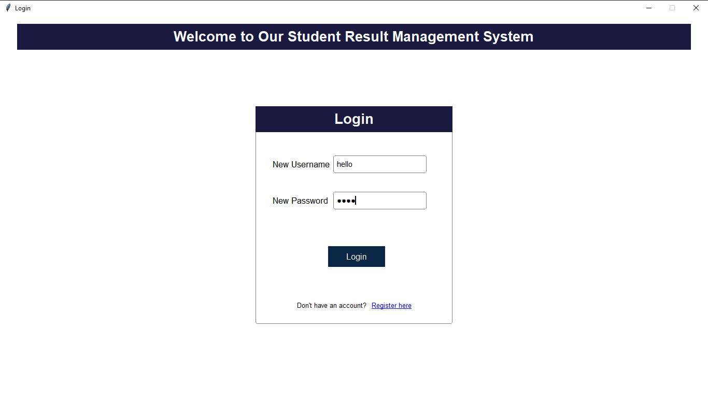

# Student Record Management System (SRMS)

This repository contains **two versions** of my Student Record Management System (SRMS) project, developed as part of my BCA Mini Project at GLA University.  
I created Version 1 while learning the basics, and then redesigned and enhanced everything in Version 2 to deliver a more robust and visually appealing application.

## Project Journey

- **Version 1 (SRMS-v1):**  
  - Built during my learning phase.  
  - I referred to an online tutorial to understand the workflow but wrote my own code and used my own design.  
  - Simple user interface with functional CRUD operations.
  - [Click here to see full details](SRMS-v1)

- **Version 2 (SRMS-v2):**  
  - Fully redesigned independently with **CustomTkinter** for a modern look.  
  - Added multiple new features, detailed validation checks, and improved user experience.  
  - Packaged as an executable using **PyInstaller** for easy distribution.
  - [Click here to see full details](SRMS-v2)

## Features

### Common Features (Both Versions)
- User registration and login with validation.  
- Dashboard for quick navigation and real-time statistics.  
- Student management (add, update, delete, search).  
- Course management (add, update, delete, prevent duplicates).  
- Result management (upload, update, calculate percentages, prevent duplicates).  
- View results by roll number in a dedicated panel.  
- Lightweight database using **SQLite3** with no external setup required.  

### Version 2 Enhancements
- Fully modernized user interface using **CustomTkinter** with images and icons.  
- Responsive, modular design with dynamic updates.  
- Stronger form validations (roll number, email, contact, DOB, pin code, etc.).  
- Dashboard auto-updates with real-time statistics.  
- Cleaner packaging for end users with a standalone executable.  

## Technologies Used

- **Programming Language:** Python 3.x  
- **GUI Framework:** Tkinter, CustomTkinter  
- **Database:** SQLite3 (RMS.db)  
- **Packaging Tool:** PyInstaller (for .exe generation)  
- **Development Environment:** Visual Studio Code on Windows  

## Repository Structure

```
/student-record-management-system
│
├── README.md                    # explains both versions + how to use
├── SRMS-v1                      # First version (learning phase)                
├── SRMS-v2                      # Second version (improved design/features)
└── releases/                    
                                 # Contains SRMS.exe + RMS.db for end users
```

## How to Use

You can either run the ready-made executable (no coding required) or run the project from source code.

### Option 1 – Run the Executable (Recommended for Normal Users)
1. Download the provided folder or ZIP containing:
   - SRMS.exe
   - RMS.db
2. Important: Keep SRMS.exe and RMS.db in the same folder.  
3. Double-click SRMS.exe to start the application.  
   - No installation or setup required.  
   - All your data will be stored inside RMS.db.  

### Option 2 – Run from Source Code
1. Make sure Python 3.x is installed on your system.      
2. Download this repository:  
   - Either Download ZIP → Extract it, OR  
   - Use Git (optional): git clone https://github.com/<your-username>/srms.git
3. Ensure RMS.db is in the same folder as the .py files.  
4. Open Command Prompt, Terminal, or Git Bash inside the project folder.  
5. Run the main file:
   `bash
   python login.py

## Project Screenshots

| SRMS v1 (Login) | SRMS v2 (Login) |
|-----------------|-----------------|
|  |  |

| SRMS v1 (Dashboard) | SRMS v2 (Dashboard) |
|---------------------|---------------------|
|  |  |

## Author

**Anshika Pathak**
BCA Semester 4 – GLA University
