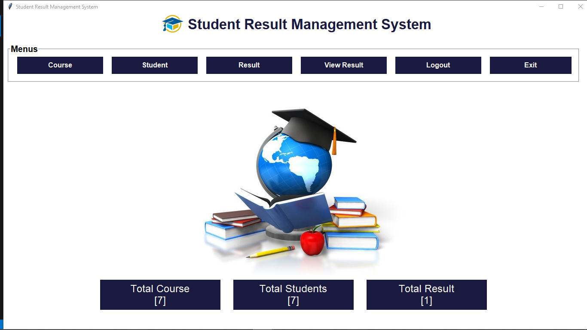

# Student Record Management System (SRMS)

This repository contains **two versions** of my Student Record Management System (SRMS) project, developed as part of my BCA Mini Project at GLA University.  
I created Version 1 while learning the basics, and then redesigned and enhanced everything in Version 2 to deliver a more robust and visually appealing application.

## Project Journey

- **Version 1 (SRMS-v1):**  
  - Built during my learning phase.  
  - I referred to an online tutorial to understand the workflow but wrote my own code and used my own design.  
  - Simple user interface with functional CRUD operations.
  - [Click here to see full details](SRMS-v1)

- **Version 2 (SRMS-v2):**  
  - Fully redesigned independently with **CustomTkinter** for a modern look.  
  - Added multiple new features, detailed validation checks, and improved user experience.  
  - Packaged as an executable using **PyInstaller** for easy distribution.
  - [Click here to see full details](SRMS-v2)

## Features Comparison

| Feature              | Version 1 (Learning Phase) | Version 2 (Improved) |
|----------------------|-----------------------------|-----------------------|
| **User Authentication** | Registration & login with password protection | Registration & login with password protection and **strong field validations** (roll no, email, contact, DOB, pin code) |
| **Dashboard**        | Simple navigation only | Modern design with **real-time statistics** (students, courses, results) |
| **Student Management** | Add, update, delete, search (no validations) | Add, update, delete, search with **validations to prevent incorrect input** |
| **Course Management** | Add, update, delete courses (duplicates prevented) | Same, but with **better error handling** |
| **Result Management** | Add results by roll no, auto-percentage | Add results by roll no, auto-percentage, **duplicate entries prevented** |
| **View Results**     | Simple search by roll number | Clean, redesigned result view |
| **Database**         | SQLite (`RMS.db`) with 4 tables → User, Student, Course, Result | Same 4 tables, but integrated with **improved validations & checks** |
| **UI Design**        | Basic Tkinter (blue & white) | **CustomTkinter** with icons & modern look |
| **Distribution**     | Run with Python / basic .exe | Packaged as a **standalone executable** (easy for end users) |


## Technologies Used

- **Programming Language:** Python 3.x  
- **GUI Framework:** Tkinter, CustomTkinter  
- **Database:** SQLite3 (RMS.db)  
- **Packaging Tool:** PyInstaller (for .exe generation)  
- **Development Environment:** Visual Studio Code on Windows  

## Repository Structure

```
/student-record-management-system
│
├── README.md                    # explains both versions + how to use
├── SRMS-v1                      # First version (learning phase)                
├── SRMS-v2                      # Second version (improved design/features)
└── releases/                    
                                 # Contains SRMS.exe + RMS.db for end users
```
## How to Use

You can run the **Student Record Management System (SRMS)** in two ways:  
- **Executable (Recommended)** → For normal users who just want to try the app.  
- **Source Code** → For developers, professors, or anyone who wants to see how it works internally.  
Choose your version below for detailed setup and screenshots:
- [How to Run SRMS v1](SRMS-v1/README.md#how-to-run)
- [How to Run SRMS v2](SRMS-v2/README.md)


## Project Screenshots

| SRMS v1 (Login) | SRMS v2 (Login) |
|-----------------|-----------------|
|  |  |

| SRMS v1 (Dashboard) | SRMS v2 (Dashboard) |
|---------------------|---------------------|
|  |  |

## Author

**Anshika Pathak**
BCA Semester 4 – GLA University
