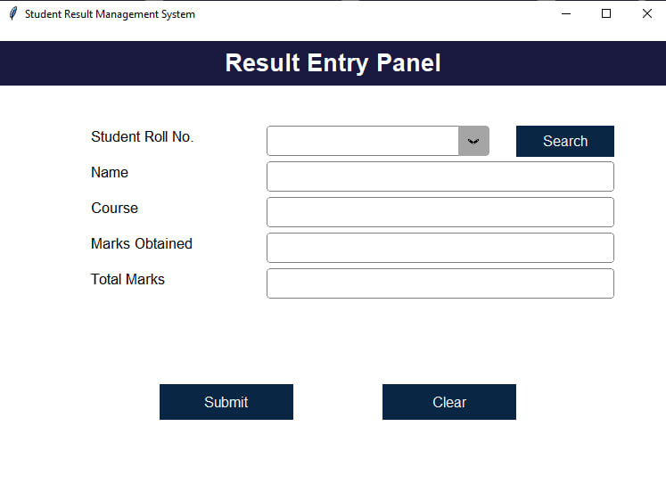

# Student Record Management System – Version 1

This is the **first version** of my Student Record Management System (SRMS).  
It was created during my learning phase to practice building a desktop CRUD application using **Python (Tkinter)** and **SQLite**.  
The design was simple (blue & white theme), but it covered the **core functionality** of student record management.

## Features

- **User Authentication**
  - Registration and login system with password protection.  

- **Dashboard**
  - Simple navigation window to access different modules.  

- **Student Management**
  - Add, update, delete, and search student records.  
  - No advanced field validations in this version.  

- **Course Management**
  - Add, update, delete courses.  
  - Duplicate course names not allowed.  

- **Result Management**
  - Enter student results by roll number.  
  - Percentage calculated automatically.  

- **View Results**
  - Search and view results by roll number in a read-only window.  

## Database

This version uses a **SQLite database** (`RMS.db`) with the following 4 tables:

- **User** → stores login/registration details  
- **Student** → stores student information (roll no, name, DOB, etc.)  
- **Course** → stores course details  
- **Result** → stores marks and calculated percentage  

The schema is created via `create_database.py`.

## Folder Structure
```
── SRMS-v1/
│
├── README.md # This README
├── login.py # Main entry file (start the application here)
├── main_dashboard.py # Dashboard module (navigation only)
├── register.py # User registration module
├── main_student.py # Student management (CRUD operations)
├── main_course.py # Course management
├── main_result.py # Result management
├── view_result.py # View results by roll number
├── create_database.py # Creates SQLite tables
├── RMS.db # SQLite database file
└── images/ # Icons and UI images
```
## Screenshots

#### Login & Register

<p float="left">
  
  
</p>

#### Dashboard

<p float="left">
  
</p>

#### Student Management

<p float="left">
  
</p>

#### Course Management

<p float="left">
  
</p>

#### Result Management

<p float="left">
  
</p>

#### View Result

<p float="left">
  
</p>

## How to Run

### Option 1 – Run the Executable (Recommended)

1. Download **SRMS-v1-Executable.zip** from the [releases](../releases) folder.  
2. Extract the `.zip` file.  
3. Make sure **SRMS.exe** and **RMS.db** are kept in the same folder.  
4. Double-click **SRMS.exe** to launch the application.  
   - ✅ No installation or setup required  
   - ✅ All data will be stored inside **RMS.db**

### Option 2 – Run from Source Code

1. Make sure **Python 3.x** is installed on your system.  
2. Download this folder (or the entire repository).  
3. Ensure `RMS.db` is in the same folder as the `.py` files.  
4. Open a terminal/command prompt inside the folder.  
5. Run the main file:  
   ```bash
   python login.py

This version was inspired by an online tutorial to understand the flow of a student management system.  
However, all code and design in this version were written by me, and I used the tutorial only as a learning reference.
